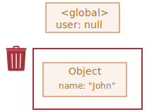
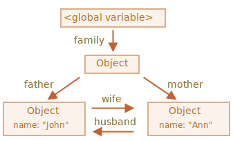

# جمع‌آوری زباله

مدیریت حافظه در جاوااسکریپت به صورت خودکار و پنهان از ما انجام می‌شود. ما مقدارهای اصلی، شیءها، تابع‌ها و غیره را می‌سازیم... تمام اینها حافظه را اشغال می‌کنند.

وقتی چیزی دیگر مورد نیاز نباشد چه اتفاقی می‌افتد؟ موتور جاوااسکریپت چگونه این را تشخیص می‌دهد و پاک می‌کند؟

## قابلیت دسترسی

مفهوم اصلی مدیریت حافظه در جاوااسکریپت *قابلیت دسترسی* است.

به بیان ساده، مقدارهای "قابل دسترس" مقدارهایی هستند که به نحوی بتوان به آنها دسترسی داشت یا از آنها استفاده کرد. ذخیره‌شدن آنها در حافظه تضمین شده است.

1. یک مجموعه از مقدارهایی که به طور ذاتی قابل دسترس هستند وجود دارد که نمی‌توانند به دلیل‌هایی واضح حذف شوند.

    برای مثال:

    - تابعی که در حال اجرا باشد، متغیرهای محلی و پارامترهای آن.
    - تابع‌های دیگر در زنجیره‌ی کنونیِ صدازدن های تو در تو، متغیرهای محلی و پارامترهای آن.
    - متغیرهای global.
    - (چند مورد دیگر هم هستند، همچنین موردهای داخلی)

    این مقدارها *ریشه* نامیده می‌شوند.

2. هر مقدار دیگری قابل دسترس فرض می‌شود اگر از یک ریشه توسط یک مرجع یا زنجیره‎ای از مراجع قابل دسترس باشد.

    برای مثال، اگر یک شیء در متغیری global وجود داشته باشد، و آن شیء یک ویژگی داشته باشد که به شیءای دیگر رجوع می‌کند، *آن* شیء قابل دسترس فرض می‌شود. و آنهایی که این شیء به آنها رجوع می‌کند هم قابل دسترس هستند. مثال‌های دارای جزئیات در ادامه آمده است.

یک فرایند پشت پرده در موتور جاوااسکریپت وجود دارد به نام [زباله جمع‌کن](https://fa.wikipedia.org/wiki/بازیافت_حافظه). این فرایند تمام شیءها را زیر نظر می‌گیرد و آنهایی که غیر قابل دسترس شده‌اند را پاک می‌کند.

## یک مثال ساده

اینجا ساده‌ترین مثال را داریم:

```js
// به شیء رجوع می‌کند user
let user = {
  name: "John"
};
```


اینجا، کمان یک مرجع شیء را نشان می‌دهد. متغیر global `"user"` به شیء `{name: "John"}` رجوع می‌کند (برای اختصار به آن John می‌گوییم). ویژگی `"name"` از John یک مقدار اصلی را ذخیره می‌کند، پس درون آن نقش بسته است.

اگر مقدار `user` بازنویسی شود، مرجع از دست می‌رود:

```js
user = null;
```



حال John غیر قابل دسترس شده است. هیج راه و مرجعی برای دسترسی به آن وجود ندارد. زباله جمع‌کن داده را دور می‌اندازد و حافظه را آزاد می‌کند.

## دو مرجع

حال بیایید تصور کنیم که مرجع را از `user` در `admin` کپی کردیم:

```js
// دارای مرجعی به شیء است user
let user = {
  name: "John"
};

*!*
let admin = user;
*/!*
```


حال اگر دوباره کار مشابه را انجام دهیم:
```js
user = null;
```

...سپس شیء هنوز توسط متغیر global `admin` قابل دسترس است، پس در حافظه وجود دارد. اگر ما `admin` را هم بازنویسی کنیم، سپس این شیء حذف می‌شود.

## شیءهای بهم پیوسته

حالا یک مثال پیچیده‌تر. خانواده:

```js
function marry(man, woman) {
  woman.husband = man;
  man.wife = woman;

  return {
    father: man,
    mother: woman
  }
}

let family = marry({
  name: "John"
}, {
  name: "Ann"
});
```

تابع `marry` دو شیء را با دادن مرجع‌های آنها به یکدیگر "بهم پیوند می‌زند" و یک شیء جدید که شامل هر دو است را برمی‌گرداند.

ساختار حافظه حاصل:



از هم اکنون، تمام شیءها قابل دسترس هستند.

حال بیایید دو مرجع را حذف کنیم:

```js
delete family.father;
delete family.mother.husband;
```


اینکه فقط یکی از دو مرجع را حذف کنیم کافی نیست، چون تمام شیءها هنوز قابل دسترس هستند.

اما اگر ما هر دو را حذف کنیم، آن گاه می‌بینیم که John دیگر هیچ مرجع ورودی ندارد:


مرجع‌های خروجی مهم نیستند. تنها مرجع‌های ورودی می‌توانند یک شیء را قابل دسترس کنند. پس John حالا غیر قابل دسترس شده است و همراه با تمام داده‌اش که آنها هم غیر قابل دسترس شده اند، از حافظه پاک می‌شود.

بعد از جمع‌آوری زباله:


## جزیره‌ی غیر قابل دسترس

اینکه تمام جزیره‌ی شیءهای بهم پیوسته غیر قابل دسترس شوند و از حافظه پاک شوند ممکن است.

شیء منبع مانند شیء بالا است. پس:

```js
family = null;
```

تصویر درون حافظه به تصویر زیر تبدیل می‌شود:


این مثال اهمیت زیاد مفهوم قابلیت دسترسی را نشان می‌دهد.

این واضح است که John و Ann هنوزم هم بهم پیوسته هستند و هر دو مرجع‌های ورودی دارند. اما این کافی نیست.

شیء سابق `"family"` از ریشه پیوندش را از دست داده است و دیگر هیچ مرجعی به آن وجود ندارد، پس تمام جزیره غیر قابل دسترس و پاک می‌شود.

## Internal algorithms

The basic garbage collection algorithm is called "mark-and-sweep".

The following "garbage collection" steps are regularly performed:

- The garbage collector takes roots and "marks" (remembers) them.
- Then it visits and "marks" all references from them.
- Then it visits marked objects and marks *their* references. All visited objects are remembered, so as not to visit the same object twice in the future.
- ...And so on until every reachable (from the roots) references are visited.
- All objects except marked ones are removed.

For instance, let our object structure look like this:


We can clearly see an "unreachable island" to the right side. Now let's see how "mark-and-sweep" garbage collector deals with it.

The first step marks the roots:


Then their references are marked:


...And their references, while possible:


Now the objects that could not be visited in the process are considered unreachable and will be removed:


We can also imagine the process as spilling a huge bucket of paint from the roots, that flows through all references and marks all reachable objects. The unmarked ones are then removed.

That's the concept of how garbage collection works. JavaScript engines apply many optimizations to make it run faster and not affect the execution.

Some of the optimizations:

- **Generational collection** -- objects are split into two sets: "new ones" and "old ones". Many  objects appear, do their job and die fast, they can be cleaned up aggressively. Those that survive for long enough, become "old" and are examined less often.
- **Incremental collection** -- if there are many objects, and we try to walk and mark the whole object set at once, it may take some time and introduce visible delays in the execution. So the engine tries to split the garbage collection into pieces. Then the pieces are executed one by one, separately. That requires some extra bookkeeping between them to track changes, but we have many tiny delays instead of a big one.
- **Idle-time collection** -- the garbage collector tries to run only while the CPU is idle, to reduce the possible effect on the execution.

There exist other optimizations and flavours of garbage collection algorithms. As much as I'd like to describe them here, I have to hold off, because different engines implement different tweaks and techniques. And, what's even more important, things change as engines develop, so studying deeper "in advance", without a real need is probably not worth that. Unless, of course, it is a matter of pure interest, then there will be some links for you below.

## Summary

The main things to know:

- Garbage collection is performed automatically. We cannot force or prevent it.
- Objects are retained in memory while they are reachable.
- Being referenced is not the same as being reachable (from a root): a pack of interlinked objects can become unreachable as a whole.

Modern engines implement advanced algorithms of garbage collection.

A general book "The Garbage Collection Handbook: The Art of Automatic Memory Management" (R. Jones et al) covers some of them.

If you are familiar with low-level programming, the more detailed information about V8 garbage collector is in the article [A tour of V8: Garbage Collection](http://jayconrod.com/posts/55/a-tour-of-v8-garbage-collection).

[V8 blog](https://v8.dev/) also publishes articles about changes in memory management from time to time. Naturally, to learn the garbage collection, you'd better prepare by learning about V8 internals in general and read the blog of [Vyacheslav Egorov](http://mrale.ph) who worked as one of V8 engineers. I'm saying: "V8", because it is best covered with articles in the internet. For other engines, many approaches are similar, but garbage collection differs in many aspects.

In-depth knowledge of engines is good when you need low-level optimizations. It would be wise to plan that as the next step after you're familiar with the language.  
